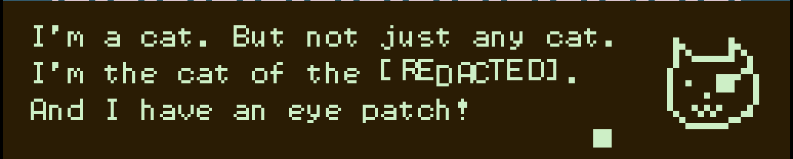

# Binski Guide

## How to use the editor

The usage of the editor should be transparent if you're already familiar with bipsi. You can check the [bipsi user guide](https://kool.tools/bipsi/user-guide.pdf) if you're lost.

To take better advantage of binksi, you will need to write an Ink story in the ink tab. If you need help, you can follow the documentation at [Writing With Ink](https://github.com/inkle/ink/blob/master/Documentation/WritingWithInk.md). 

The editor comes preloaded with an example story. You can find [the example file in the repository](https://github.com/smwhr/binksi/blob/main/data/story.ink).

## Additional Bipsi functions and variables

Theses variables and functions are available in all javascript fields of events.  

* `STORY` : the `Story` object as provided by `inkjs`.
* `SET_INK_VAR(varname, value)` : save the variable `varname` inside of ink with value `value`.
* `GET_INK_VAR(varname)` : extract the value of the variable `varname` from inside of ink.
* `DIVERT_TO(knot_name)` : jump to the knot `knot_name` and continue the story from there. (this is equivalent to `ChoosePathString`)

## Additional Bipsi event properties

* `say-style, JSON` : `say-style` will behave for all text said by ink as if it were said by regular `dialog`. If a `say-style` is defined on the player character, all said text will default to that style.

## Custom ink syntax

These custom snippets are to be written in your ink story.  
They extend ink syntax and will be interpreted by the binksi engine at runtime.

### Tagged choices

* `* [tag: mytagname]` or `+[tag: mytagname]` :  
    Tag a choice inside of your story if you want it to be actionned by an event in your bipsi scene.  
    Add an event inside of you bipsi scene and add a tag with the same name.  
    If your avatar touches an event that has the same `tagname` as a choice, this choice is triggered in ink and the story continues.  
    _Note_: tagged choices do not prevent your avatar from moving in the scene.
* `* [auto: invisible action]` or `+[auto: invisible action]` :  
    When the bipsi players encouters an `auto` choice, it will automatically use it.  
    It is very useful if you want to hide some choices during play while keeping them around in your ink file.  
    When encountered, the story continues.  
* `Classic choices` :  
    When the bipsi players encounters a non-tagged choice, it will stop everything happening in the bipsi scene.  
    The avatar won't be able to move until an option has been chosen.  
    A maximum of 4 choices will be displayed, each a recommended maximum of 38 characters (this is not enforced but adding longer text can lead to unforseen consequences).  
    The player will be able to chose an option using arrow or swipes in the 4 directions.

### Ink tags

* `#TITLE` :  
    If a text is tagged with `#TITLE`, it will be displayed in bipsi's `TITLE` format (text only in the middle of the bipsi game area).

* `#character` or `#character-sentiment` : Portrait mode :  
    If a text is tagged with `#character-sentiment`, it will try to find an event tagged `character` and look for a file field named `sentiment` (sentiment will default to `"neutral"` if given sentiment file is not found.). It will display the dialog using "portrait mode" :

      

    _Example 1_: You cannot go there ! # guard-angry  
    _Example 2_: Thank you for the chocolate, please come in ! # guard-happy  

### Custom syntax in ink
Just write those in your ink script as if it were text.  
They should be written alone on a single line.

* `SPAWN_AT(teleport_name)` :  
    When encountered in the text of the story, bipsi will try to teleport the avatar on an event tagged with `teleport_name`.  
    The name should _not_ be enclosed in any quotes.  
    If the teleport target does not exist, nothing happens and the story continues.  
    _Tip_: `teleport_name` can be a printed variable, (eg: `SPAWN_AT({lastVisitedRoom})`).
    _Example_: See [the example file in the repository](https://github.com/smwhr/binksi/blob/main/data/story.ink).

* `SPAWN_AT(teleport_name, event_name)` :  
    When encountered in the text of the story, bipsi will try to move the selected event `event_name` on an event tagged with `teleport_name`.  
    Both names should _not_ be enclosed in any quotes.  
    If the teleport target or the event do not exist, nothing happens and the story continues. 
    _Tip_: You cannot create new event _on-the-fly_, you should create a "store room" where you can take event from and put them back.

* `CUTSCENE(event_name[ ,field_name])` :  
    When encountered in the text of the story, bipsi will try to trigger the cutscene found in the javascript field `field_name` on a event tagged with `event_name`. `field_name` is optional and will default to the javascript `"touch"` field.  
    Both names should _not_ be enclosed in any quotes.  
    The field identified by `field_name` _must_ be a javascript field. In the context of the javascript field, all usual variables can be used. The `EVENT` variable references the event named in the first argument.  
    If the event target or the field do not exist, nothing happens and the story continues. 
    _Example_: See [the example file in the repository](https://github.com/smwhr/binksi/blob/main/data/story.ink).

## Rules of touch

* if multiple events are on the same square, they are all touched (this behaviour differs from bipsi)
* if a `touch` script field is defined, only it will be triggered
* if the touch matches a tagged choice (see above) then the `before` script will be triggered before sending the choice to ink ; standard events and then `after` script will be triggered right after the first paragraph sent by ink.
* otherwise standard bipsi touch rules apply.