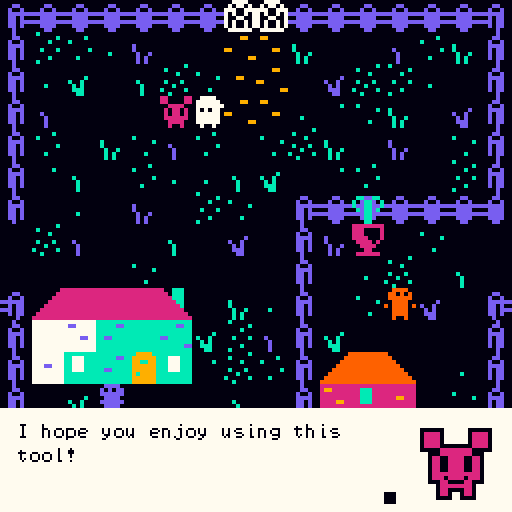
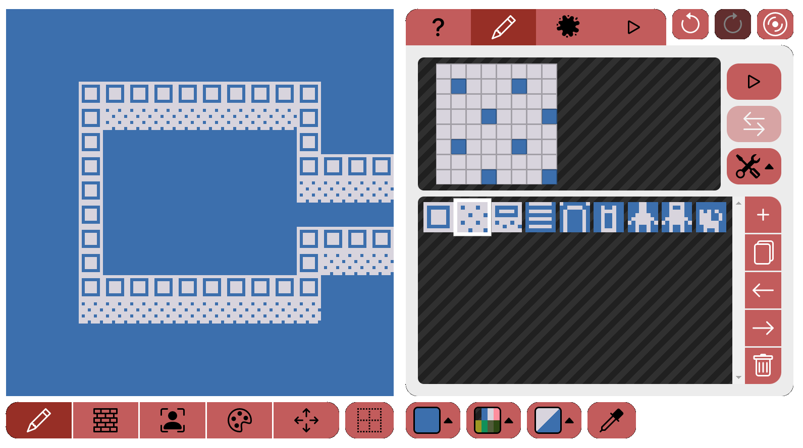
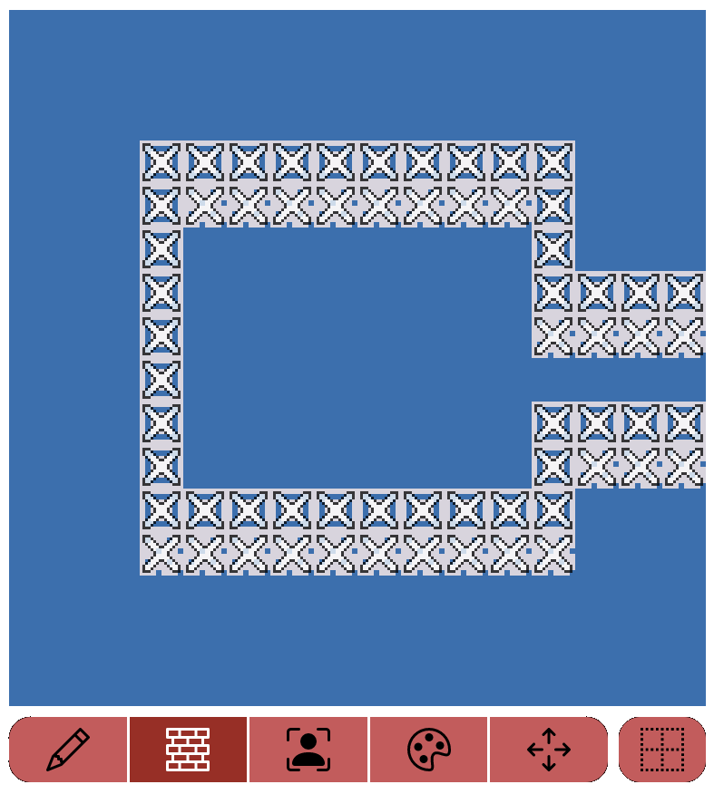
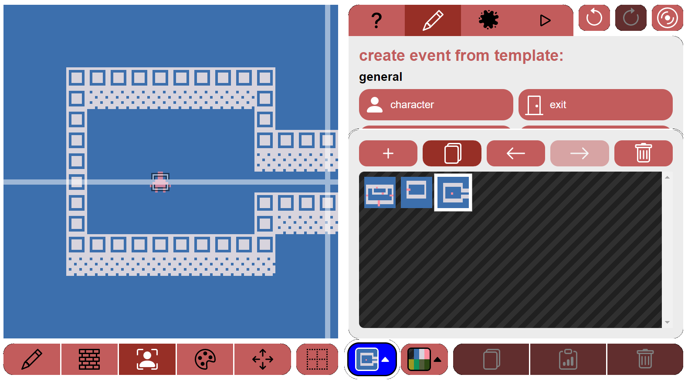
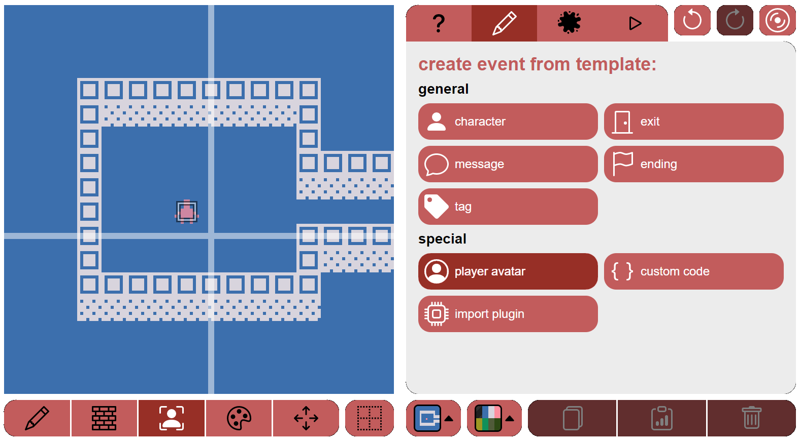
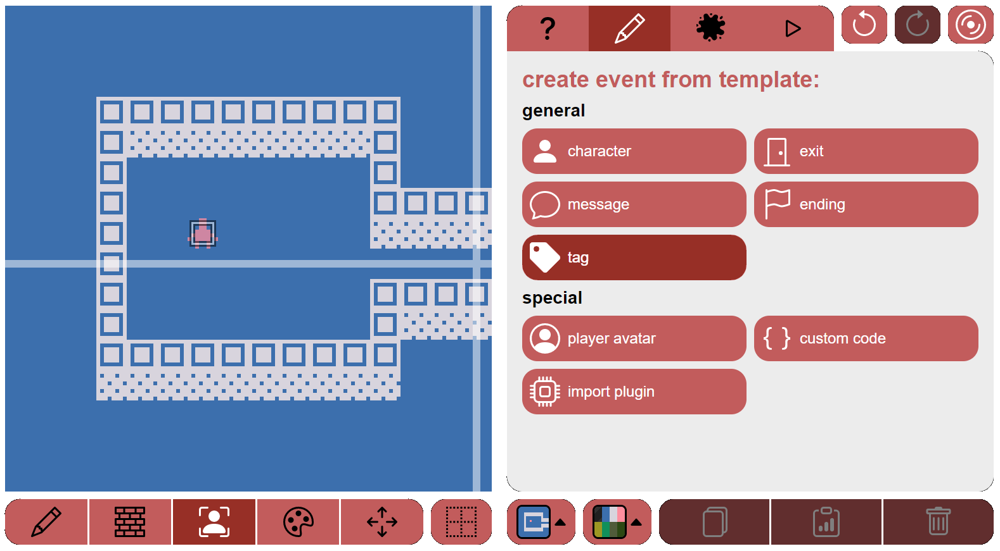
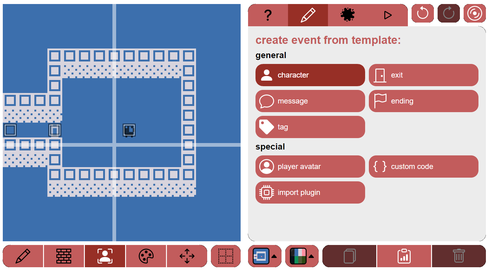
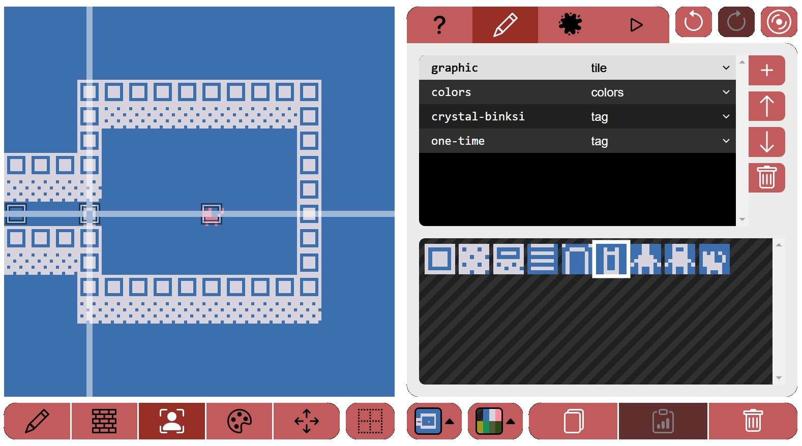
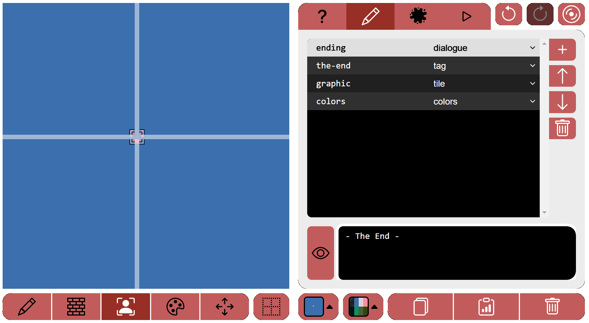

# Binski Guide

## How to use the editor

The usage of the editor should be transparent if you're already familiar with bipsi. You can check the [bipsi user guide](https://kool.tools/bipsi/user-guide.pdf) if you're lost.

To take better advantage of binksi, you will need to write an Ink story in the ink tab. If you need help, you can follow the documentation at [Writing With Ink](https://github.com/inkle/ink/blob/master/Documentation/WritingWithInk.md). 

The editor comes preloaded with an example story. You can find [the example file in the repository](https://github.com/smwhr/binksi/blob/main/data/story.ink).

## Additional Bipsi functions and variables

Theses variables and functions are available in all javascript fields of events.  

* `STORY` : the `Story` object as provided by `inkjs`.
* `SET_INK_VAR(varname, value)` : save the variable `varname` inside of ink with value `value`.
* `GET_INK_VAR(varname)` : extract the value of the variable `varname` from inside of ink.
* `DIVERT_TO(knot_name)` : jump to the knot `knot_name` and continue the story from there. (this is equivalent to `ChoosePathString`)

## Additional Bipsi event properties

* `say-style, JSON` : `say-style` will behave for all text said by ink as if it were said by regular `dialog`. If a `say-style` is defined on the player character, all said text will default to that style.

## Custom ink syntax

These custom snippets are to be written in your ink story.  
They extend ink syntax and will be interpreted by the binksi engine at runtime.

### Tagged choices

* `* [tag: mytagname]` or `+[tag: mytagname]` :  
    Tag a choice inside of your story if you want it to be actionned by an event in your bipsi scene.  
    Add an event inside of you bipsi scene and add a tag with the same name.  
    If your avatar touches an event that has the same `tagname` as a choice, this choice is triggered in ink and the story continues.  
    _Note_: tagged choices do not prevent your avatar from moving in the scene.
* `* [auto: invisible action]` or `+[auto: invisible action]` :  
    When the bipsi players encouters an `auto` choice, it will automatically use it.  
    It is very useful if you want to hide some choices during play while keeping them around in your ink file.  
    When encountered, the story continues.  
* `Classic choices` :  
    When the bipsi players encounters a non-tagged choice, it will stop everything happening in the bipsi scene.  
    The avatar won't be able to move until an option has been chosen.  
    A maximum of 4 choices will be displayed, each a recommended maximum of 38 characters (this is not enforced but adding longer text can lead to unforseen consequences).  
    The player will be able to chose an option using arrow or swipes in the 4 directions.


### Ink tags

* `#TITLE` :  
    If a text is tagged with `#TITLE`, it will be displayed in bipsi's `TITLE` format (text only in the middle of the bipsi game area).

* `#character` or `#character-sentiment` : Portrait mode :  
    If a text is tagged with `#character-sentiment`, it will try to find an event tagged `character` and look for a file field named `sentiment` (sentiment will default to `"neutral"` if given sentiment file is not found.). It will display the dialog using "portrait mode" : 

    | Neutral                               |  Happy                               |
    | -------------                         | -----                                |
    | |  |


    _Example 1_: Hi there, fellow binksi user. #rosalia-neutral

    _Example 2_: I hope you enjoy using this tool! #rosalia-happy 


### Custom syntax in ink
Just write those in your ink script as if it were text.  
They should be written alone on a single line.

* `SPAWN_AT(teleport_name)` :  
    When encountered in the text of the story, bipsi will try to teleport the avatar on an event tagged with `teleport_name`.  
    The name should _not_ be enclosed in any quotes.  
    If the teleport target does not exist, nothing happens and the story continues.  
    _Tip_: `teleport_name` can be a printed variable, (eg: `SPAWN_AT({lastVisitedRoom})`).
    _Example_: See [the example file in the repository](https://github.com/smwhr/binksi/blob/main/data/story.ink).


* `SPAWN_AT(teleport_name, event_name)` :  
    When encountered in the text of the story, bipsi will try to move the selected event `event_name` on an event tagged with `teleport_name`.  
    Both names should _not_ be enclosed in any quotes.  
    If the teleport target or the event do not exist, nothing happens and the story continues. 
    _Tip_: You cannot create new event _on-the-fly_, you should create a "store room" where you can take event from and put them back.

* `CUTSCENE(event_name[ ,field_name])` :  
    When encountered in the text of the story, bipsi will try to trigger the cutscene found in the javascript field `field_name` on a event tagged with `event_name`. `field_name` is optional and will default to the javascript `"touch"` field.  
    Both names should _not_ be enclosed in any quotes.  
    The field identified by `field_name` _must_ be a javascript field. In the context of the javascript field, all usual variables can be used. The `EVENT` variable references the event named in the first argument.  
    If the event target or the field do not exist, nothing happens and the story continues. 
    _Example_: See [the example file in the repository](https://github.com/smwhr/binksi/blob/main/data/story.ink).


## Rules of touch

* if multiple events are on the same square, they are all touched (this behaviour differs from bipsi)
* if a `touch` script field is defined, only it will be triggered
* if the touch matches a tagged choice (see above) then the `before` script will be triggered before sending the choice to ink ; standard events and then `after` script will be triggered right after the first paragraph sent by ink.
* otherwise standard bipsi touch rules apply.


# Quick Tutorial

Here's a very quick tutorial to get you started!

Binksi works in a slightly different way than bipsi. While bipsi is self-contained, in binksi the game is comprised of two different dimensions: the world (bipsi) and the script (ink).

A good metaphor is that all the rooms, the player avatar, characters and items, are like a theatrical play. The characters and your avatar are puppets, the items are props and the rooms are different stage decorations. However, you can't have a play without a script! And this is where ink comes in: Using the the ink script, you tell your little puppet avatar what it can or can't interact with, what a character says or what happens next.

This tutorial will assume a basic understanding of ink.

That said, let's get started!

## Setting up a room

Binksi comes preloaded with a demo game, but in this case we want to start afresh! Open the "switch rooms" panel (in dark blue) and press +. A new room will be created.


Navigate to the "draw tiles" mode (pencil on the bottom-left corner of the screen), select a tile from the panel and start drawing on the canvas on the left!



Once you are happy with the way the room looks, you need to set up walls so your avatar can't just walk trhough the walls you just drew with tiles.

Go to the "draw walls" mode (briked wall icon on the bottom-left corner of the screen) and select what tiles are not walkable!



If you want to create rooms quickly, you can also duplicate them! Instead of pressing + in the "switch rooms" panel, press the copy button.



I will use this shortcut to create a mirrored version of this first room, and then tweak the tiles and walls.

Now, you need to set up the room in ink! Navigate to `edit story` (the tab on the right panel with the splotch of ink icon).

There's many ways to go around this, but the simples method is to set up every room as a knot:
```
=== left_room

-> left_room

=== right_room
-
-> right_room
```

### Placing the avatar in the new room

Feel free to erase the binksi demo rooms! Open the switch rooms panel and bin them!

However, you have now deleted the player avatar! Do not fret, you can just create it again by going to the "edit events" mode (the bust picture icon under the left canvas). Select an empty space with the reticule and click on the `player avatar` button.



Place the avatar somewhere inside the room.

(Using the Player Avatar button you can respawn the avatar in a new room if you have lost it in one of your rooms and can't find it.)

### Creating an exit

Now we need an exit to go from one room to another! In bipsi you'd use an `exit` event. However, in binksi this works a bit different!

Go to the "edit events" mode, select the space where you want to place the event with the reticule and use the `tag` template.



Change the name of the tag from `tagname` to something a bit more descriptive, like `left-room-exit`.

In ink we now create an option in each room so we can interact with the exit tags, and teleport the avatar to another room:

```
=== left_room

+ [tag: left-room-exit]
    SPAWN_AT(right-room-exit)
    -> right_room

-
-> left_room


=== right_room

+ [tag: right-room-exit]
    SPAWN_AT(left-room-exit)
    -> left_room
-
-> right_room
```

As you can see, we are not only using the binksi `SPAWN_AT()` function, but you also need to divert the flow of the ink to the new room. If you forget to do this, the avatar will quite literally be unable to interact with the world, as it'll have lost the flow of the script!

## Creating a character

Next, let's create a character to interact with in the second room. Pixel the Cat.

Navigate to the second room we created, and on the "edit events" mode use the Character template.



Edit the character to your liking and make sure you change the name of the `character-tagname`/tag field to something a bit more descriptive! In this case we're doing `pixel-the-cat` even if it's a bit long.

In the ink, we're actually planning to have Pixel appear in the second room, but once we speak to him, he'll teleport to the first room - and will have something different to say!

For this I've set up a `cat-warp`/tag event i the first room.

This is what the story will look like at this stage:

```

=== left_room

+ [tag: left-room-exit]
    SPAWN_AT(right-room-exit)
    -> right_room

+ [tag: pixel-the-cat]
  Hello! I'm here now!

-
-> left_room


=== right_room

+ [tag: right-room-exit]
    SPAWN_AT(left-room-exit)
    -> left_room

+ [tag: pixel-the-cat]
  Did you enjoy your \~\~crystal binksi\~\~?
  ++ Yes
     That's great!
  ++ No
     That's too bad...
  --
 Anyway, I want to go to the other room. See ya!
 SPAWN_AT(cat-warp, pixel-the-cat)

-
-> right_room

```

As we're having Pixel warping just after you speak to him, we could technically used a normal choice `*` instead of a sticky `+` one. However, if you plan on having a character stick around, you better use a sticky choice! Otherwise the character will say the script once and then will stay there but you the avatar won't be able to interact with it anymore!

You can of course mix it up using variables! You can have a first dialogue where you're forced to make a choice. Then based on that first interaction, Pixel will say A or B if you interact with him again. It'd look like this:

```
=== right_room
...

* [tag: pixel-the-cat]
  Did you enjoy your \~\~crystal binksi\~\~?
  ++ Yes
     That's great!
     ~ liked_binksi = true
  ++ No
     That's too bad...
     ~ liked_binksi = false
  --

+ {liked_binksi} [tag: pixel-the-cat]
    I love crystal binksi too :)

+ {not liked_binksi} [tag: pixel-the-cat]
    I guess crystal binksi is too sweet...
```

However, we're not doing this in this tutorial game.

### Creating a collectible item

But what is this Crystal Binksi that Pixel keeps talking about? A collectible item!

We're placing it in the corridor on room to right room, just before we meet Pixel. In a place it's impossible we will talk to him before we pick this up.

Just in the same way we created Pixel, use the `character` template, but add a new tag field called `one-time`. This will ensure that once the item is interacted with the engine will delete it and make it disappear. 



As before, in this case you can use either a normal `*` or a sticky `+` choice. We will place it in the `right_room` knot:

```
=== right_room
...

+ [tag: crystal-binksi]
    \~\~Hmmm...\~\~ A refreshing can of crystal binksi.
```


If you want it so the avatar can't walk over the item, feel free to add a `solid`/tag field too.

## Finishing up the game

We're almost done! Now the last thing to do is to ensure the game has an end trigger! For this we are creating an event using the Ending template. This is just as it would work in bipsi: write the wrapping sentence(s) in the bipsi text editor in the `ending`/dialogue field. Once the game shows that text box the game will end.



In this case we've also added graphics and colours to the event by adding the `graphic`/tile and `colors`/colors fields. And for a nice effect, we've placed the event in a "warehouse" room that is inaccesible to the player, so we can keep it hidden from view there. We will make it so once you speak to Pixel for the first time, the ending event will teleport to the space where the avatar appear once the game starts: a tag event named `game-start`.

And thus, this is the full script for the game:

```
tutorial ==binksi== game #TITLE

-> init

=== init
+ [auto: start game]
    SPAWN_AT(game-start)
    -> left_room

=== left_room

+ [tag: left-room-exit]
    SPAWN_AT(right-room-exit)
    -> right_room

+ [tag: pixel-the-cat]
  Hello! I'm here now!

-
-> left_room


=== right_room

+ [tag: right-room-exit]
    SPAWN_AT(left-room-exit)
    -> left_room

+ [tag: crystal-binksi]
    \~\~Hmmm...\~\~ A refreshing can of crystal binksi.

+ [tag: pixel-the-cat]
  Did you enjoy your \~\~crystal binksi\~\~?
  ++ Yes
     That's great!
  ++ No
     That's too bad...
  --
 Anyway, I want to go to the other room. See ya!
 SPAWN_AT(cat-warp, pixel-the-cat)
 SPAWN_AT(game-start, the-end)

-
-> right_room
```

Congratulations! You now have a fully working binksi game!
